## 🍹 NOWBartend - 원하는 바를 내 근처에서!
<!---->

<br>
<!--
-->
<br>


## 프로젝트 소개
### **🍹 칵테일 바 검색 및 예약 서비스 플랫폼!**

특별한 날을 더욱 특별하게 만들고 싶나요? 이제 칵테일 바를 쉽고 빠르게 검색하고 예약할 수 있습니다!

우리 플랫폼에서는 **사용자 위치 기반의 칵테일 바 검색과 편리한 예약 시스템**을 제공합니다. 인기 있는 바를 찾고, 원하는 좌석을 미리 예약하여 특별한 시간을 즐겨보세요.

**다양한 바를 탐색하고, 웨이팅 없이 즐기는 스마트한 방법!** 지금 바로 서비스를 이용해보세요.
<br>

## 👤 팀원 소개

|                                                                       👑이가희                                                                       |                                                                      순우연                                                                       |                                                                     이경훈                                                                     |
  |:-----------------------------------------------------------------------------------------------------------------------------------------------:|:----------------------------------------------------------------------------------------------------------------------------------------------:|:---------------------------------------------------------------------------------------------------------------------------------------------:|
| <a href="https://github.com/rlagywnd4" target="_blank"></a> | <a href="https://github.com/DeaHyun0911" target="_blank"></a> | <a href="https://github.com/kyung412820" target="_blank"> </a> |
|                                                   [@rkgml0324](https://github.com/rlagywnd4)                                                    |                                                 [@hequrik111](https://github.com/DeaHyun0911)                                                  |                                                [@kyung412820](https://github.com/kyung412820)                                                 |
|                                                                 검색, 예약, 쿠폰, 팔로잉                                                                 |                                                              북마크,웨이팅,CI/CD,AWS,검색                                                              |                                                        동시성제어, 근처 가게 조회, 인증 인가, 소셜 로그인                                                         |


<br>

## 📝 **와이어프레임**
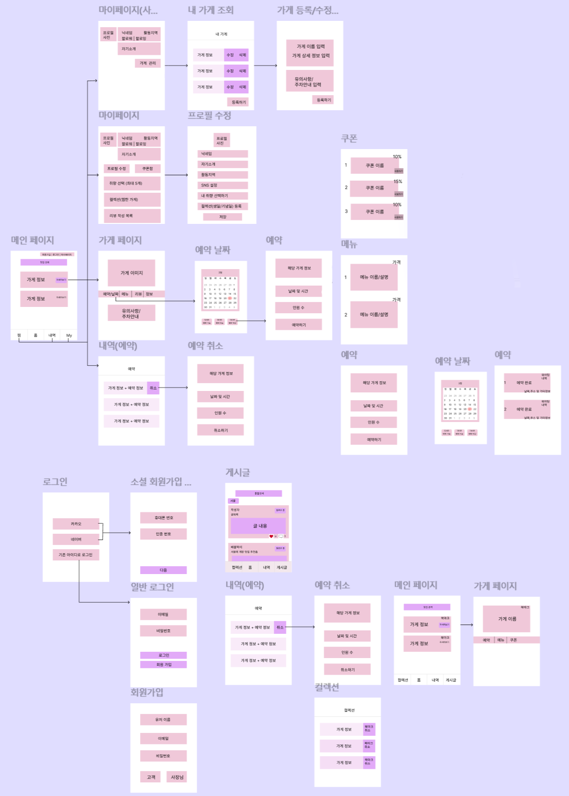

## 💬 **ERD**
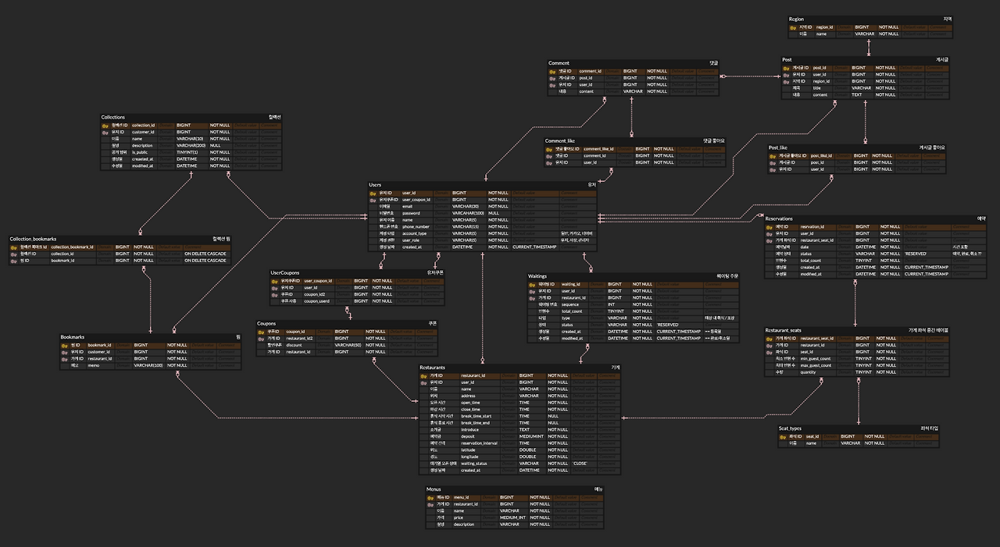

## 🏆 **Architecture**
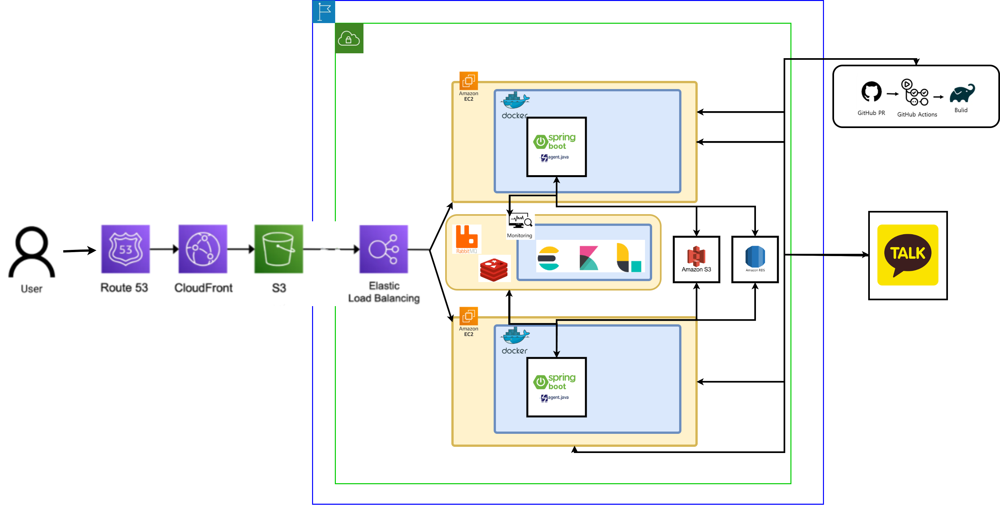

<br>

## 📚 **기술 스택**

### Frontend

<table>
  <tr>
    <td width="80px" height="60px">
      <a href="https://www.tcpschool.com/html/html5_intro_intro" target="_blank"></a>
    </td>
    <td width="80px" height="60px">
      <a href="https://www.w3schools.com/css/" target="_blank"></a>
    </td>

  </tr>
  <tr align='center'>
    <td>HTML5</td>
    <td>CSS3</td>
  </tr>
</table>

<br/>

### Backend

<table>
  <tr>
    <td width="80px" height="60px">
      <a href="https://www.java.com/" target="_blank"></a> 
    </td>
    <td width="80px" height="60px">
      <a href="https://docs.spring.io/spring-framework/docs/3.0.x/reference/expressions.html#:~:text=The%20Spring%20Expression%20Language%20(SpEL,and%20basic%20string%20templating%20functionality." target="_blank"></a>  
    </td>
    <td width="80px" height="60px">
      <a href="https://www.mysql.com/" target="_blank"></a>  
    </td>
    <td width="80px" height="60px">
      <a href="https://redis.io/" target="_blank"></a>
    </td>
    <td width="80px" height="60px">
      <a href="https://hibernate.org/" target="_blank"></a>
    </td>
  </tr>
  <tr align='center'>
    <td>Java</td>
    <td>Spring</td>
    <td>Mysql</td>
    <td>Redis</td>
    <td>Hibernate</td>
  </tr>
</table>

<table>
  <tr>
    <td width="80px" height="60px">
      <a href="https://https://spring.io/projects/spring-security" target="_blank"></a>
    </td>
   <td width="80px" height="60px">
      <a href="https://gradle.org/" target="_blank"></a>
    </td>
  </tr>
  <tr align='center'>
    <td>Spring<br/>security</td>
    <td>Gradle</td>
  </tr>
</table>

<table>
  <tr>
    <td width="80px" height="60px">
      <a href="https://oauth.net/" target="_blank">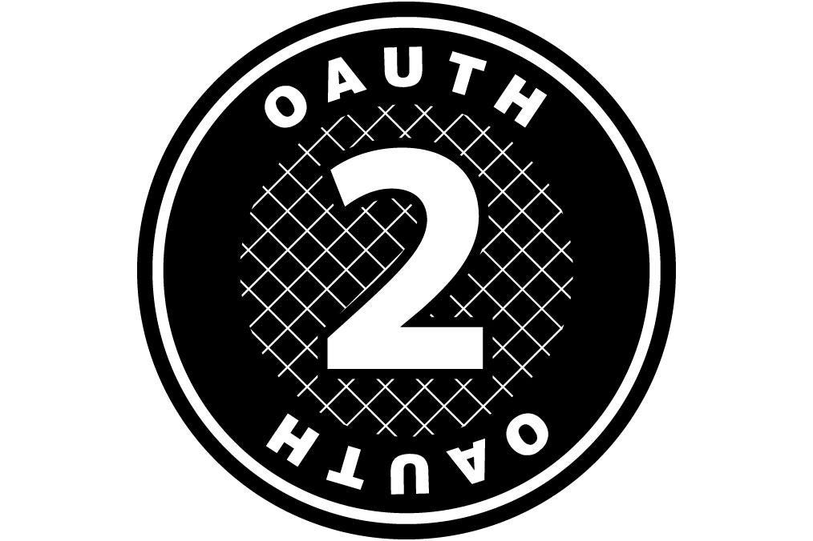</a>
    </td>
   <td width="80px" height="60px">
      <a href="http://www.jasypt.org/" target="_blank">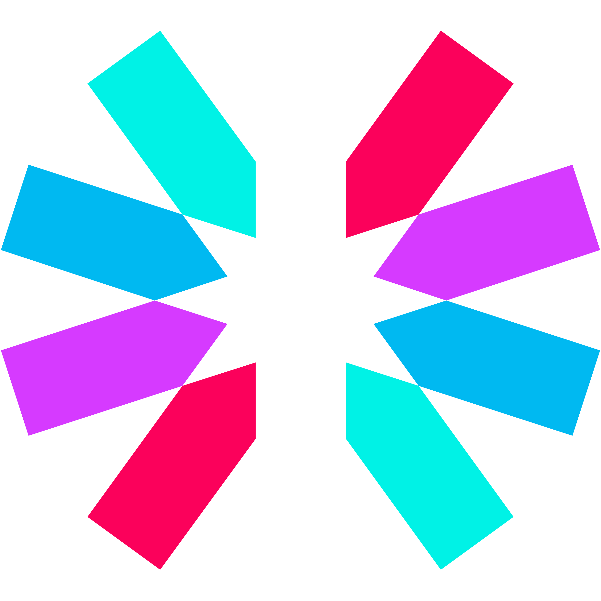</a>
    </td>
    <td width="80px" height="60px">
      <a href="https://www.rabbitmq.com/" target="_blank">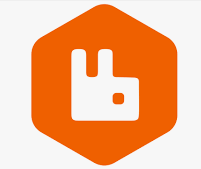</a>
    </td>
  </tr>
  <tr align='center'>
    <td>OAuth 2.0</td>
    <td>Jwt</td>
    <td>RabbitMQ</td>
  </tr>
</table>

<table>
  <tr>
    <td width="80px" height="60px">
      <a href="https://www.elastic.co/kr/" target="_blank">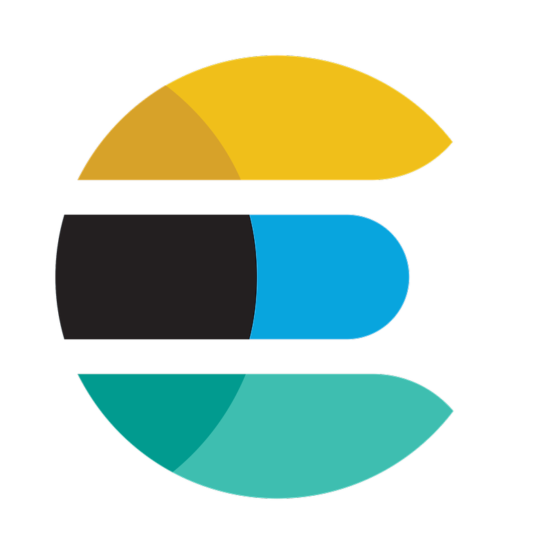</a>
    </td>
   <td width="80px" height="60px">
      <a href="https://www.elastic.co/kr/kibana" target="_blank">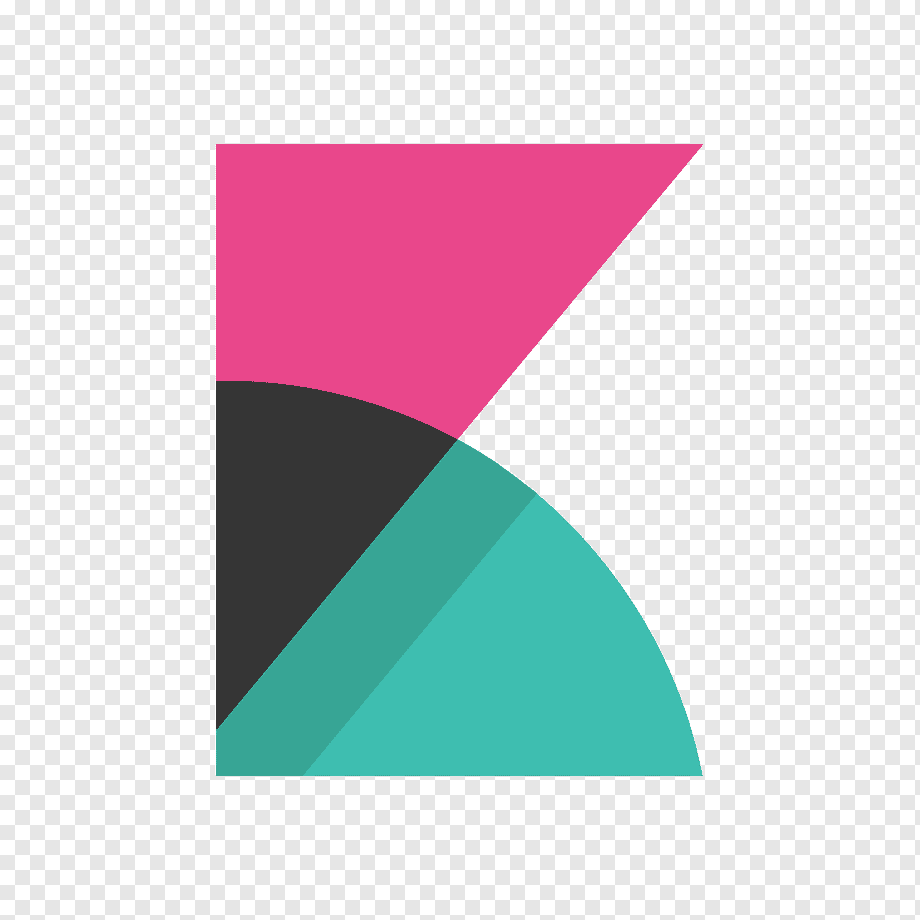</a>
    </td>
    <td width="80px" height="60px">
      <a href="https://www.elastic.co/kr/logstash" target="_blank"></a>
    </td>
  </tr>
  <tr align='center'>
    <td>elasticsearch</td>
    <td>kibana</td>
    <td>logstash</td>
  </tr>
</table>

<br/>

### DevOps

<table>
  <tr>
    <td width="80px" height="60px">
      <a href="https://aws.amazon.com/" target="_blank"></a> 
    </td>
    <td width="80px" height="60px">
      <a href="https://www.docker.com/" target="_blank"></a> 
    </td>
  </tr>
  <tr align='center'>
    <td>AWS</td>
    <td>Docker</td>
  </tr>
</table>

<br/>

### Tools

<table>
  <tr>
    <td width="80px" height="60px">
      <a href="https://github.com/" target="_blank"></a>
    </td>
    <td width="80px" height="60px">
      <a href="https://slack.com/intl/ko-kr" target="_blank"></a>  
    </td>
    <td width="80px" height="60px">
      <a href="https://github.com/features/actions" target="_blank">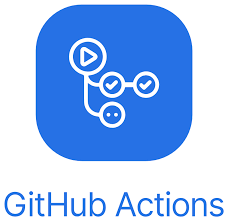</a>  
    </td>
  </tr>
  <tr align='center'>
    <td>Github</td>
    <td>Slack</td>
    <td>GithubActions</td>
  </tr>
</table>

<br/>

<div id="3"></div>

<br>

# 🎯 프로젝트 주요 기능

## 📍 1. 가게 필터 검색
사용자 위치 기반 주변 가게 검색
- 검색어 기반 가게 이름/메뉴 검색
- 주소로 가게 검색
- 가격 범위 기반 가게 검색
- 좌석 타입 기준 가게 검색

### 🔍 정렬 옵션:
- 인기 순
- 가까운 순

## 📅 2. 예약 서비스
- 사용자가 예약하고자 하는 날짜와 시간, 인원 수, 좌석 타입을 선택하여 예약을 진행

## ⏳ 3. 웨이팅 서비스
### 🏠 고객 기능
- 웨이팅 등록
- 웨이팅 취소
- 현재 가게 웨이팅 대기 팀 수 확인
- 현재 웨이팅 대기열 순위 조회

### 📌 사장 기능
- 웨이팅 상태 수정
- 웨이팅 대기열 내 유저 삭제
- 웨이팅 대기열 조회 (페이지네이션 지원)

## 💬 4. 유저 커뮤니티
- 지역마다 유저 간 정보를 공유할 수 있는 게시글 / 댓글 커뮤니티 제공

## 🎟 5. 쿠폰 관리
### 🏪 가게 기능
- 가게별 일반 쿠폰 및 이벤트 쿠폰 생성 및 관리

### 👤 유저 기능
- 유저별 쿠폰 다운로드 및 관리

## ⭐ 6. 북마크 / 컬렉션 관리
- 유저가 특정 가게들을 북마크로 등록하여 관리하는 기능
- 여러 북마크들을 하나의 컬렉션으로 묶어서 관리할 수 있는 기능

## 🔔 7. 알림 서비스
- 예약 및 웨이팅 성공 알림 발송
- 예약 날짜 임박 알림 발송

<br>

# 🔒 **트러블슈팅**

# 랜덤 피드와 커서 기반 페이징 문제 해결

## 문제 원인
커서 기반 페이징은 기본적으로 **고정된 정렬 순서**를 유지해야만 작동할 수 있다. 하지만 **랜덤 정렬**은 요청할 때마다 다른 결과를 반환하므로, 두 개의 개념이 상충된다.

특히, 인스타그램 피드와 같은 **무한 스크롤 방식의 피드**를 구현하려 할 때, 다음과 같은 문제가 발생한다:

- 커서 기반 페이징은 정렬 순서가 일관되어야 한다.
- 랜덤 피드는 매번 다른 결과를 반환한다.
- 따라서 커서 기반 페이징과 랜덤 피드는 기본적으로 공존하기 어렵다.

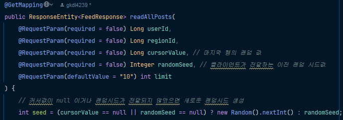
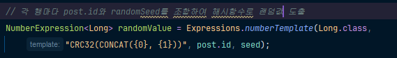

## 문제 이유

1. **랜덤 정렬을 그대로 적용하면** 사용자가 스크롤을 내릴 때마다 같은 게시글이 반복되거나, 새로운 게시글이 중간에 끼어드는 문제가 발생할 수 있다.
2. **커서 기반 페이징을 그대로 적용하면** 피드의 무작위성을 유지할 수 없고, 항상 고정된 순서로 게시글이 노출된다.
3. **새로운 게시글이 추가될 경우**, 기존에 정렬된 랜덤 순서가 깨질 가능성이 있다.

## 해결 방법
이를 해결하기 위해 **고정된 랜덤 시드 방식**을 도입하였다.

```markdown
1. **초기 피드 요청 시, 서버에서 랜덤 시드를 생성**하고 이를 클라이언트에 전달한다.
2. **각 게시글의 ID와 랜덤 시드를 기반으로 해시 값(CRC32)을 생성**하여, 이를 기준으로 정렬한다.
3. **커서 기반 페이징을 적용할 때, 마지막 랜덤 값보다 큰 해시 값을 가진 게시글을 조회**하여 일관된 순서를 유지한다.
4. **새로운 게시글이 추가되었을 경우**, 기존의 랜덤 시드로 해시 값을 계산하여, 기존 게시글들과 일관된 방식으로 정렬한다.
5. **새로고침을 하면 새로운 랜덤 시드를 생성**하여 피드를 재정렬한다.
```

### 구현 방식

```markdown
- 게시글의 ID와 랜덤 시드를 조합하여 해시 함수를 적용 (예: CRC32)
- 해당 해시 값을 기준으로 오름차순 정렬
- 커서 기반 페이징을 적용하여 일관된 순서 유지
- 새로운 피드 요청(새로고침) 시 새로운 랜덤 시드 적용
```

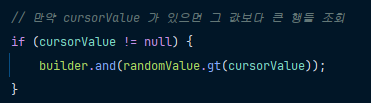
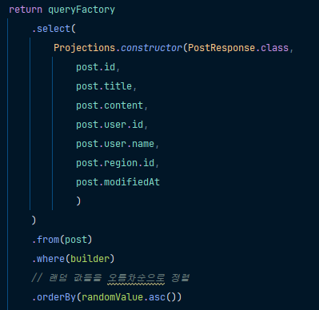

이 방식으로 **한 세션 동안 고정된 랜덤 피드 순서를 유지하면서도, 커서 기반 페이징이 정상적으로 작동**하도록 구현하였다.

<br>

# 예약이 알림에 의존성 발생

## 문제 상황

초기 구현에서는 예약이 성공하면 **고객에게 총 3개의 알림**(예약 확정 알림, 하루 전 알림, 1시간 전 알림)을 **Notification 객체**로 생성하여 DB에 저장하고, 스케줄러를 이용해 전송 예정 시각에 맞춰 이메일을 발송하도록 하였다.

```java
Reservation reservation = Reservation.builder()
                .date(request.date())
                .totalCount(request.totalCount())
                .user(user)
                .restaurantSeat(restaurantSeat)
                .build();

reservationRepository.save(reservation);

Notification notification = Notification.builder()
                .userId(reservation.getUser().getId())
                .message("예약이 확정되었습니다. 예약 ID: " + reservation.getId() + "\n예약 시간: " + reservation.getDate())
                .email(user.getEmail())
                .scheduledTime(LocalDateTime.now())
                .build();

notificationRepository.save(notification);

reservationReminder(reservation, user, 24);
reservationReminder(reservation, user, 1);
```

## 문제 원인

현재 **AOP를 활용하여 예약 생성 서비스 로직을 임계 영역으로 설정하고 분산 락으로 동시성을 제어**하고 있었다. 하지만 예약을 생성하는 과정에서 **알림 3개를 함께 생성하여 DB에 저장하는 로직이 포함**되었기 때문에 문제가 발생했다.

- 예약 생성이 완료되었음에도 불구하고 **알림 객체 생성이 끝나기 전까지 락이 유지**됨.
- 역할과 책임이 분리되지 않아 **예약 서비스의 지연 가능성**이 높아짐.

## 해결책: 메시지 큐를 활용한 비동기 처리

예약과 알림 간의 결합도를 낮추기 위해 **메시지 큐를 도입하여 비동기적으로 처리**하도록 변경하였다.

### 변경된 흐름

1. **예약이 성공하면** `ReservationNotificationEvent` 객체를 생성하여 예약 정보를 담는다.
2. **이벤트 프로듀서가 메시지 큐에 이벤트를 발행**하면, 예약 서비스는 즉시 종료된다.
3. **알림 서비스는 메시지 큐에서 이벤트를 소비**하고 알림을 생성 및 전송한다.

```java
Reservation reservation = Reservation.builder()
                .date(request.date())
                .totalCount(request.totalCount())
                .user(user)
                .restaurantSeat(restaurantSeat)
                .build();

reservationRepository.save(reservation);

// 예약 생성 후 이벤트 발행
ReservationNotificationEvent event = new ReservationNotificationEvent(
                reservation.getId(),
                reservation.getUser().getId(),
                reservation.getDate()
);
eventProducer.sendReservationEvent(event);
```

```java
public class EventProducer {
    private final RabbitTemplate rabbitTemplate;

    public void sendReservationEvent(ReservationNotificationEvent event) {
        rabbitTemplate.convertAndSend(
                RabbitMQConfig.EXCHANGE,
                RabbitMQConfig.ROUTING_KEY,
                event
        );
    }
}
```

이렇게 변경함으로써 **예약 서비스의 락 유지 시간을 최소화**하고, 예약과 알림 기능을 독립적으로 운영할 수 있게 되었다.

---

## 분산 환경에서 스케줄러가 중복된 알림을 보낼 위험

## 문제 상황

현재 구현에서는 **스케줄러가 5분마다 DB에서 알림을 조회**하여, `isSent=false` 이면서 전송 예정 시간을 지난 알림을 찾아 이메일을 발송하는 구조였다.

```java
// 5분마다 현재 시간이 전송해야 하는 시간을 지난 알림을 찾아 처리
@Scheduled(cron = "0 */5 * * * ?")
public void processDueNotifications() {
    LocalDateTime now = LocalDateTime.now();
    List<Notification> dueNotifications = notificationRepository.findDueNotifications(now);
    for (Notification notification : dueNotifications) {
        notificationService.sendNotificationEmail(notification);
    }
}
```

```java
public void sendEmail(Notification notification) {
    SimpleMailMessage message = new SimpleMailMessage();
    message.setFrom(SENDER);
    message.setTo(notification.getEmail());
    message.setSubject("예약 알림");
    message.setText(notification.getMessage());
    mailSender.send(message);

    // isSent -> True 로 업데이트
    notification.updateSent();
    notificationRepository.save(notification);
}
```

## 문제 원인

**분산 환경에서 여러 개의 서버가 실행될 경우**, 서로 상태를 공유하지 않기 때문에 **각 서버의 스케줄러가 거의 동시에 실행될 가능성이 존재**한다.

- 각 서버의 스케줄러가 `isSent=false` 상태의 알림을 조회하여 가져옴.
- 여러 서버에서 동시에 같은 알림을 처리하게 되어 **이메일이 중복 발송되는 문제**가 발생할 수 있음.

## 해결책: MySQL의 `UPDATE` 결과 값을 활용하여 중복 방지

MySQL에서는 `UPDATE` 쿼리를 실행하면 **영향을 받은 행(row)의 개수를 반환**한다. 이를 활용하여 **메일을 보내기 전에 `isSent` 값을 먼저 업데이트**하고, 업데이트된 행이 1개 이상이면 이메일을 발송하는 구조로 변경하였다.

### 변경된 흐름

1. **`isSent=false`인 알림을 `true`로 업데이트하는 쿼리 실행**
2. **업데이트된 행이 존재하는 경우에만 메일 전송**

```java
@Scheduled(cron = "0 */5 * * * ?")
public void processDueNotifications() {
    LocalDateTime now = LocalDateTime.now();
    List<Notification> dueNotifications = notificationRepository.findDueNotifications(now);

    for (Notification notification : dueNotifications) {
        // 먼저 isSent 값을 true로 업데이트
        int updatedRows = notificationRepository.updateIsSent(notification.getId(), true);
        
        // 업데이트된 행이 존재할 경우에만 이메일 전송
        if (updatedRows > 0) {
            notificationService.sendNotificationEmail(notification);
        }
    }
}
```

```java
@Modifying
@Query("UPDATE Notification n SET n.isSent = :isSent WHERE n.id = :id AND n.isSent = false")
int updateIsSent(@Param("id") Long id, @Param("isSent") boolean isSent);
```

이렇게 변경함으로써 **여러 개의 스케줄러가 동시에 실행되더라도 중복 발송이 방지**된다.


<br>


<br>
